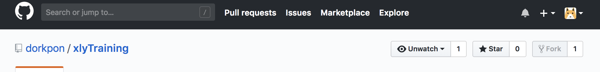
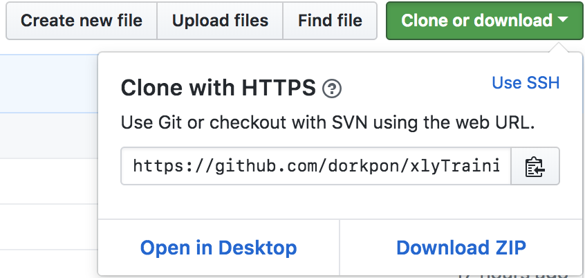

# 使用方法

点击右上角的fork按钮fork老师的代码到自己的Git中：

fork之后，打开自己的profile页，进入刚刚fork过来的项目。

然后在自己的git bash控制台里输入：git clone 自己的git仓库地址

仓库地址的查看：绿色的clone or download按钮点击后可查看

clone到本地之后就可以编写了，之后提交的代码就会自动进入自己fork的仓库中。